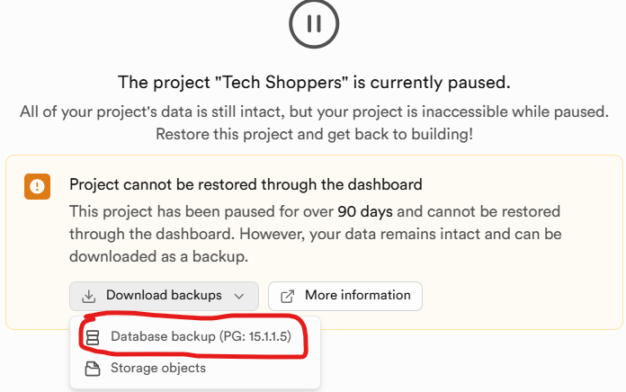

- Download the backup db file from supabase.com as shown here:
  

- Install **PostGreSQL** for Windows (need to provide superuser pass and port number). I have used 5432(default) as the port number that the server should listen on.

- Launch **pgadmin4**, provide superuser pass and connect to the server

- create a new database named **techshoppers_local** by right clicking on the **Databases** dropdown from the file tree in the left

- open command prompt from **C:\Program Files\PostgreSQL\17\bin** and execute the following commands:

  - ```psql --version```  : to verify that the psql command is available; it is installed along with postgres

  - ```psql -U postgres -d techshoppers_local -f "F:\4-1\cse408-soft-development\TechShoppers\db_cluster-24-05-2024@13-16-54.backup"```  : to restore the tables from the backup file which contains SQL statements; replace this file path with the actual path the file is stored on your local machine

- To verfiy that the tables are indeed restored, type **psql** in search bar, click on the app titled **SQL Shell (psql)**, provide the information asked (host, username, pass) and run **\dt** command to view list of the tables

- Set new values for these environment variables in .env file: 
  
  ```HOST = localhost```

  ```USER = postgres```

  ```PASSWORD = <your-postgres-password>```

